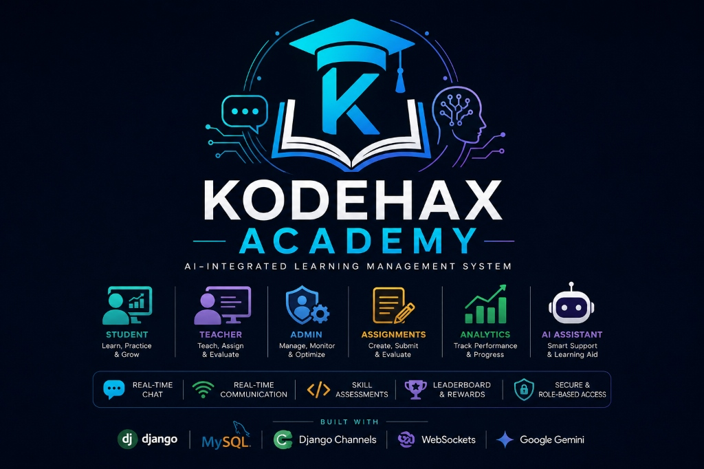
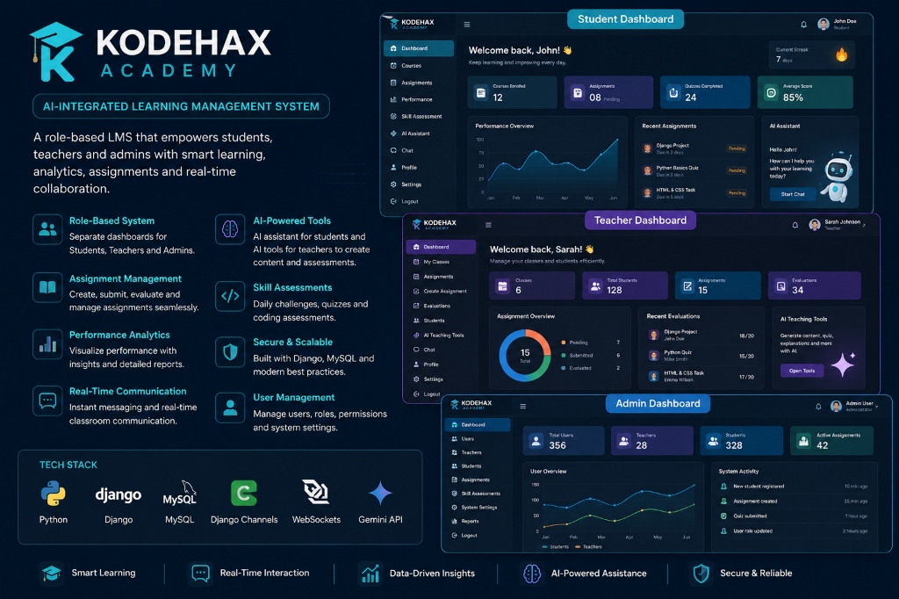

<p align="center">
  
</p>

<h1 align="center">🎓 Kodehax Academy — AI-Powered Learning Platform</h1>

<p align="center">
  <strong>Role-based classrooms, AI-assisted teaching tools, adaptive skill assessment, and daily coding challenges — all in one Django platform.</strong>
</p>

<p align="center">
  
  
  
  
  
</p>

---

## ✨ Features

Kodehax Academy is designed to be practical, technical, and AI-assisted from the ground up. Here are the core features:

| Feature | Description | Status |
| :--- | :--- | :---: |
| **🔐 Role-Based Access** | Separate student, teacher, and admin flows with role-aware auth, redirects, and dashboards. | ✅ Done |
| **🤖 AI-Assisted Teaching** | Gemini-powered quiz generation, lecture notes, coding-assignment authoring, and grading. | ✅ Done |
| **🧠 Skill Assessment Engine** | Weighted scoring across self-assessment, MCQs, and coding tasks, with skill-level classification. | ✅ Done |
| **🔥 Daily Coding Challenges** | Adaptive challenge generation, sandboxed execution, hints, penalties, and points tracking. | ✅ Done |
| **🏫 Classroom Management** | Create classes, manage enrollments, author assignments, auto-grade quizzes. | ✅ Done |
| **📊 Performance Analytics** | Student progress records and classroom-level analytics views. | ✅ Done |
| **💬 AI Chat Assistant** | Contextual Gemini-backed chat for tutoring, course Q&A, and quiz practice. | ✅ Done |
| **🛠️ Admin Console** | Platform settings, maintenance mode, teacher approvals, platform-wide analytics. | ✅ Done |
| **📱 Device-Aware Rendering** | Mobile template routing for a dedicated mobile UX on key screens. | ✅ Done |

<p align="center">
  
</p>
<p align="center"><sub>Concept preview of the student, teacher, and admin dashboards</sub></p>

---

## 🏗️ Architecture & Data Flow

Kodehax Academy is a single Django project split into purpose-built apps, with Gemini handling every AI-assisted flow:


---

## 📂 Project Structure

```text
kodehax/
├── kodehax_academy/      # project settings, middleware, mobile rendering, root urls
├── accounts/             # account flows, OTP/email-related templates and services
├── users/                # custom user model, auth redirects, shared entry views
├── student/              # student dashboards, submissions, chat memory, APIs
├── teacher/              # classroom, assignments, grading, AI tools, performance
├── adminpanel/           # platform management, maintenance mode, admin dashboards
├── skill_assessment/     # assessment content, scoring, skill profile logic
├── daily_challenges/     # challenge generation, code runner, points, sessions
├── chat/                 # Gemini client integration and chat views
├── templates/            # desktop, mobile, shared, role-specific templates
├── static/               # Tailwind source, compiled CSS, images
├── media/                # uploaded files and generated user content
└── manage.py             # Django entry point
```

---

## 🚀 Getting Started

### 📋 Prerequisites

Before running the application, make sure you have:
- [Python](https://www.python.org/) 3.10+
- [Node.js](https://nodejs.org/) (for the Tailwind build)
- [MySQL](https://www.mysql.com/) — or use the bundled test_settings for SQLite
- A [Gemini API key](https://ai.google.dev/) for the AI-assisted features

### 🛠️ Installation & Setup

1. **Clone the project and enter the directory:**
   ```bash
   git clone https://github.com/Mubashir-114/kodehax_academy.git
   cd kodehax_academy
   ```

2. **Install dependencies (Python + frontend):**
   ```bash
   python -m venv venv
   # On Windows: venv\Scripts\activate | On Linux/Mac: source venv/bin/activate
   pip install -r requirements.txt
   npm ci
   ```

3. **Configure environment variables:**
   Create a `.env` file in the project root:
   ```env
   DEBUG=True
   PRODUCTION=False
   SECRET_KEY=replace-me
   ALLOWED_HOSTS=127.0.0.1,localhost
   GEMINI_API_KEY=replace-me
   EMAIL_HOST=smtp.gmail.com
   EMAIL_PORT=587
   EMAIL_HOST_USER=
   EMAIL_HOST_PASSWORD=
   EMAIL_USE_TLS=True
   DAILY_CHALLENGE_TIMEZONE=Asia/Kolkata
   DAILY_CHALLENGE_PUBLISH_HOUR=10
   DB_NAME=kodehax_academy
   DB_USER=root
   DB_PASSWORD=your-password
   DB_HOST=localhost
   DB_PORT=3306
   ```

   > [!TIP]
   > SQLite is reserved for tests with `--settings=kodehax_academy.test_settings`. Development and production use MySQL.

4. **Migrate the database and create a superuser:**
   ```bash
   python manage.py migrate
   python manage.py createsuperuser
   ```

5. **Build the frontend and start the server:**
   ```bash
   npm run tailwind:build
   python manage.py runserver
   ```
   Then open `http://127.0.0.1:8000/` 🎉

---

## 📦 Key Dependencies

- **Backend Framework:** Django
- **AI Integration:** google-genai (Gemini)
- **Database:** PyMySQL 1.1.1 with RSA authentication support
- **Static Files:** whitenoise
- **Media Storage:** Cloudinary · django-storages
- **Deployment:** Gunicorn and Render native Python

---

## 🔒 Security & Best Practices

- Secrets (`SECRET_KEY`, `GEMINI_API_KEY`, DB and email credentials) are environment-managed via `.env` and never hardcoded.
- Daily-challenge submissions run in a restricted sandbox — limited imports, blocked system calls, and wall-clock timeouts.
- Account registration and recovery flows include OTP/email-related templates under `accounts/`.
- `PRODUCTION=True` requires explicit MySQL credentials and production security settings.

---

## 🗺️ Roadmap

- [ ] Add automated test coverage for core student and teacher workflows
- [ ] Move sensitive development defaults fully into environment variables
- [ ] Add richer dashboard analytics and reporting
- [ ] Expand mobile-specific coverage for more classroom screens
- [ ] Add CI for migrations, linting, and template build validation

---

## 📄 License

This project is licensed under the [MIT License](LICENSE).

<p align="center">Made with ❤️ for practical, AI-assisted technical education.</p>


## Render native Python deployment

Create a Web Service from `https://github.com/Mubashir-114/kodehax_academy`, using your release branch and repository root (leave Root Directory empty). Select **Python 3** and preferably a **paid Starter or higher** instance for SMTP OTP and pre-deploy migrations.

| Setting | Value |
| --- | --- |
| Build command | `bash build.sh` |
| Start command | `gunicorn kodehax_academy.wsgi --bind 0.0.0.0:$PORT` |
| Health check | `/health/` |
| Pre-deploy (paid service) | `python manage.py migrate --noinput` |
| Python version | `PYTHON_VERSION=3.12.12` |
| Node version | `NODE_VERSION=22.16.0` |

Render's [native runtimes include Node and npm](https://render.com/docs/native-runtimes). `build.sh` installs Python dependencies, runs `npm ci --include=dev` and `npm run tailwind`, then `collectstatic`. No migrations run during build or startup. WhiteNoise serves collected static assets. Scripts use LF line endings.

### Required production environment

Set these privately in Render's Environment settings:

```env
PRODUCTION=True
DEBUG=False
SECRET_KEY=<long-random-private-secret>
ALLOWED_HOSTS=<service>.onrender.com,your-domain.example
CSRF_TRUSTED_ORIGINS=https://<service>.onrender.com,https://your-domain.example
DB_NAME=<existing-database>
DB_USER=<database-user>
DB_PASSWORD=<database-password>
DB_HOST=<reachable-mysql-provider-hostname>
DB_PORT=3306
PYTHON_VERSION=3.12.12
NODE_VERSION=22.16.0
```

Render supplies `PORT`. Hosts are comma-separated bare hostnames; trusted origins include HTTPS schemes. Production rejects missing secrets/hosts/database values and DEBUG=True. Secure cookies, HTTPS redirect, and HSTS default on. Django recognizes Render's forwarded HTTPS header. `/health/` bypasses HTTPS redirect and maintenance database lookups; it reports liveness, not database readiness.

Host MySQL **separately** and retain the existing schema, data, and migration history. Use MySQL 8.0.11+ for Django 5.2, with provider DNS/port, user permissions, and firewall rules allowing Render outbound connections. `localhost` identifies the web service itself, not the provider. Back up existing data before releases. Do not reset tables or generate replacement migrations.

PyMySQL is used because Render's documented native tools do not guarantee MySQL development headers for mysqlclient. Project initialization calls `pymysql.install_as_MySQLdb()` before Django's backend loads. PyMySQL 1.1.1's compatibility interface satisfies Django **5.2.5** without version overrides; reverify before upgrading Django. The RSA extra supports modern MySQL authentication.

### Verified MySQL TLS

Set `DB_SSL_REQUIRED=True` when required by your provider. Encryption, certificate chain verification, and hostname verification are enforced using system trust roots. For a private provider CA, upload its PEM as a Render Secret File and set `DB_SSL_CA=/etc/secrets/<ca-file>.pem` (also enables verified TLS). Ensure it is available during build and runtime. Use the certificate's DNS hostname as DB_HOST. Do not disable verification to work around errors. Client-certificate authentication is not configured.

### Migrations by plan

On a paid service, set the separate pre-deploy command above. Render [supports pre-deploy on paid web services](https://render.com/docs/deploys). Review `python manage.py migrate --plan` and apply only the existing migrations once per release.

Free services do not offer this pre-deploy step or an interactive service shell. Before routing users to each release, run `python manage.py migrate --noinput` from a trusted workstation or CI runner with the same release, production environment, and MySQL connectivity/TLS. Keep credentials private. Coordinate this manually; `/health/` passing does not prove migrations are applied. Never add migrations to build.sh or the Gunicorn start command.

### Remaining deployment blockers

- **Email OTP:** verification, non-admin login OTP, and recovery need working email delivery. Set `EMAIL_BACKEND=django.core.mail.backends.smtp.EmailBackend`, `EMAIL_HOST`, `EMAIL_PORT`, `EMAIL_HOST_USER`, `EMAIL_HOST_PASSWORD`, `EMAIL_USE_TLS`, `EMAIL_USE_SSL`, and verified `DEFAULT_FROM_EMAIL`. `EMAIL_TIMEOUT` defaults to 30 seconds. Missing credentials default to console delivery, which sends no user email. [Free Render services block outbound SMTP ports 25, 465, and 587](https://render.com/docs/free); choose paid hosting for the existing SMTP implementation. An HTTPS email API requires separate work. Real delivery is unverified.
- **Uploaded media:** uploads use local `media/`, Render's filesystem is ephemeral, and Django's production URL configuration does not serve media with DEBUG=False. Installed Cloudinary/storage packages do not activate storage. Durable object storage with Django configuration, or a paid persistent disk plus production media serving, and transfer of existing uploads remain necessary. These are not implemented here.
- **AI:** set `GEMINI_API_KEY` with usable quota. Optional `TIME_ZONE`, `DAILY_CHALLENGE_TIMEZONE`, `DAILY_CHALLENGE_PUBLISH_HOUR` default to Asia/Kolkata and hour 10. Existing upload-limit/security environment overrides remain supported. No external scheduler was added.

### Verification commands

```bash
python -m pip check
python manage.py check
python manage.py check --deploy
python manage.py test --settings=kodehax_academy.test_settings
npm ci --include=dev
npm run tailwind
python manage.py collectstatic --noinput
# Only with an authorized reachable MySQL connection:
python manage.py check --database default
python manage.py migrate --plan
```

SQLite test settings are preserved. Live MySQL checks, migration execution, and TLS negotiation require an actual reachable server.
