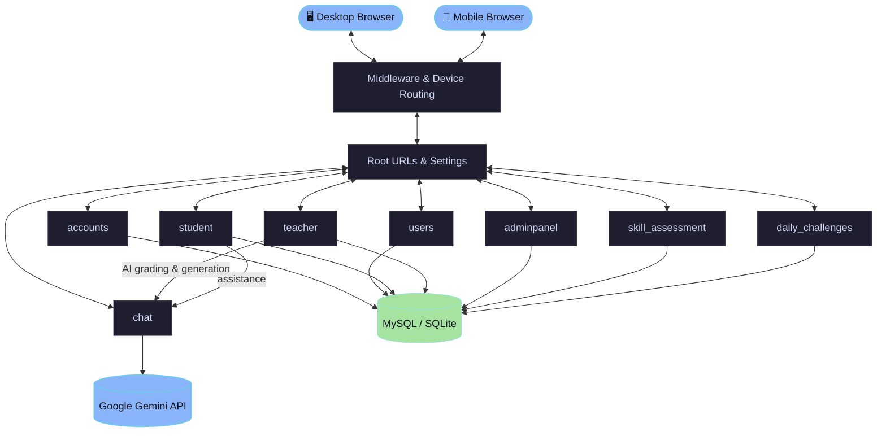

<p align="center">
  
</p>

<h1 align="center">🎓 Kodehax Academy — AI-Powered Learning Platform</h1>

<p align="center">
  <strong>Role-based classrooms, AI-assisted teaching tools, adaptive skill assessment, and daily coding challenges — all in one Django platform.</strong>
</p>

<p align="center">
  
  
  
  
  
</p>

---

## ✨ Features

Kodehax Academy is designed to be practical, technical, and AI-assisted from the ground up. Here are the core features:

| Feature | Description | Status |
| :--- | :--- | :---: |
| **🔐 Role-Based Access** | Separate student, teacher, and admin flows with role-aware auth, redirects, and dashboards. | ✅ Done |
| **🤖 AI-Assisted Teaching** | Gemini-powered quiz generation, lecture notes, coding-assignment authoring, and grading. | ✅ Done |
| **🧠 Skill Assessment Engine** | UI-based assessments with skill-profile classification and weak-topic tracking. | ✅ Done |
| **🔥 Daily Coding Challenges** | Adaptive challenge generation, sandboxed execution, hints, penalties, and points tracking. | ✅ Done |
| **🏫 Classroom Management** | Create classes, manage enrollments, author assignments, auto-grade quizzes. | ✅ Done |
| **📊 Performance Analytics** | Student progress records and classroom-level analytics views. | ✅ Done |
| **💬 AI Chat Assistant** | Contextual Gemini-backed chat for tutoring, course Q&A, and quiz practice. | ✅ Done |
| **🛠️ Admin Console** | Platform settings, maintenance mode, teacher approvals, platform-wide analytics. | ✅ Done |
| **📱 Device-Aware Rendering** | Mobile template routing for a dedicated mobile UX on key screens. | ✅ Done |

---

## 🏗️ Architecture & Data Flow

Kodehax Academy is a single Django project split into purpose-built apps, with Gemini handling every AI-assisted flow:



---

## 📂 Project Structure

```bash
kodehax/
├── kodehax_academy/   # project settings, middleware, mobile rendering, root urls
├── accounts/           # account flows, OTP/email-related templates and services
├── users/               # custom user model, auth redirects, shared entry views
├── student/             # student dashboards, submissions, chat memory, APIs
├── teacher/             # classroom, assignments, grading, AI tools, performance
├── adminpanel/           # platform management, maintenance mode, admin dashboards
├── skill_assessment/     # assessment content, scoring, skill profile logic
├── daily_challenges/     # challenge generation, code runner, points, sessions
├── chat/                 # Gemini client integration and chat views
├── templates/             # desktop, mobile, shared, role-specific templates
├── static/                 # Tailwind source, compiled CSS, images
├── media/                   # uploaded files and generated user content
└── manage.py                 # Django entry point
```
---

## 🚀 Getting Started

### 🧰 Prerequisites

- **Python 3.10+**
- **Node.js** (for the Tailwind build)
- **MySQL** — or use the included `kodehax_academy.test_settings` for SQLite
- A **Gemini API key** for AI-assisted features (see `GEMINI_API_KEY` below)

### ⚙️ Installation & Setup

1. **Clone the repository and enter the directory**
   ```bash
   git clone <repo-url>
   cd kodehax
   ```

2. **Set up a virtual environment and install dependencies**
   ```bash
   python -m venv venv
   source venv/bin/activate                  # Linux/macOS
   # venv\Scripts\activate                   # Windows
   pip install -r requirements.txt
   npm install
   ```

3. **Configure environment variables**
   Create a `.env` file in the project root:
   ```env
   DEBUG=True
   PRODUCTION=False
   SECRET_KEY=replace-me
   ALLOWED_HOSTS=127.0.0.1,localhost
   GEMINI_API_KEY=replace-me
   EMAIL_HOST=smtp.gmail.com
   EMAIL_PORT=587
   EMAIL_HOST_USER=
   EMAIL_HOST_PASSWORD=
   EMAIL_USE_TLS=True
   DAILY_CHALLENGE_TIMEZONE=Asia/Kolkata
   DAILY_CHALLENGE_PUBLISH_HOUR=10
   DB_URL=
   ```

4. **Run migrations and create a superuser**
   ```bash
   python manage.py migrate
   python manage.py createsuperuser
   ```

5. **Build the frontend and start the server**
   ```bash
   npm run tailwind:build
   python manage.py runserver
   ```
   Then open **http://127.0.0.1:8000/** 🎉

> [!TIP]
> No local MySQL? Run with `--settings=kodehax_academy.test_settings` to use SQLite instead.

---

## 📦 Key Dependencies

- **Backend Framework:** `Django`
- **AI Integration:** `google-genai` (Gemini)
- **Database:** `mysqlclient` · `dj-database-url`
- **Static Files:** `whitenoise`
- **Media Storage:** `Cloudinary` · `django-storages`
- **Deployment:** `gunicorn` · Docker

---

## 🔒 Security & Best Practices

- Secrets (`SECRET_KEY`, `GEMINI_API_KEY`, DB/email credentials) are environment-managed via `.env` and never hardcoded.
- Daily-challenge submissions run in a restricted sandbox — limited imports, blocked system calls, and wall-clock timeouts.
- Account registration and recovery flows include OTP/email verification under `accounts/`.
- `PRODUCTION=True` switches the database over to a parsed `DB_URL` instead of local hardcoded credentials.

---

## 🗺️ Roadmap

- [ ] Add automated test coverage for core student and teacher workflows
- [ ] Move sensitive development defaults fully into environment variables
- [ ] Add richer dashboard analytics and reporting
- [ ] Expand mobile-specific coverage for more classroom screens
- [ ] Add CI for migrations, linting, and template build validation

---

## 📄 License

This repository does not currently declare a license. Add one before public distribution if you plan to open-source the project.

---

<p align="center">Made with ❤️ for practical, AI-assisted technical education.</p>