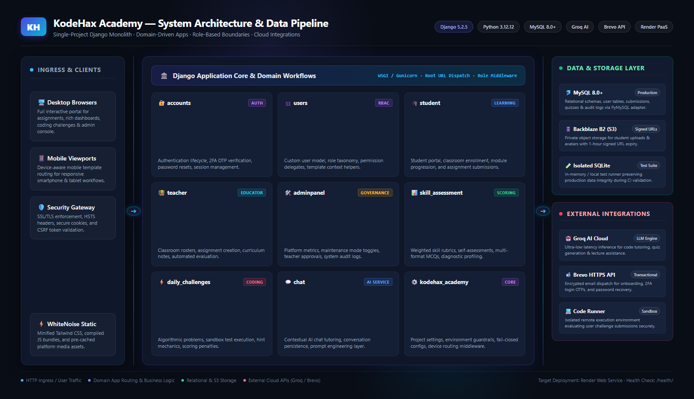

<p align="center">
  
</p>

<h1 align="center">🎓 Kodehax Academy</h1>
<h3 align="center">AI-Powered Learning & Developer Education Platform</h3>

<p align="center">
  A Django-based learning platform for structured programming education, classroom workflows, daily coding challenges, and role-aware academic operations.
</p>

<p align="center">
  
  
  
  
  
  
</p>

<p align="center">
  <a href="#overview">Overview</a> ·
  <a href="#features">Features</a> ·
  <a href="#preview">Preview</a> ·
  <a href="#architecture">Architecture</a> ·
  <a href="#tech-stack">Tech Stack</a> ·
  <a href="#engineering-highlights">Engineering Highlights</a> ·
  <a href="#project-structure">Project Structure</a> ·
  <a href="#quick-start">Quick Start</a> ·
  <a href="#configuration">Configuration</a> ·
  <a href="#testing">Testing</a> ·
  <a href="#security">Security</a> ·
  <a href="#deployment">Deployment</a> ·
  <a href="#documentation">Documentation</a> ·
  <a href="#contributing">Contributing</a> ·
  <a href="#license">License</a>
</p>

---

## Overview

Kodehax Academy is a role-aware developer education platform that blends classroom operations, coding practice, and AI-assisted guidance in a single Django application. Students work through assignments and challenges, teachers manage classrooms and assessment workflows, and administrators oversee platform health and operations.

The product is designed to feel like an academic learning system rather than a static course portal. It combines structured learning, guided assessment, challenge-based coding, and actionable progress signals in one experience.

### Product pillars

- Structured learning pathways
- AI-assisted educational support
- Daily coding challenges and scoring
- Student and teacher dashboards
- Secure role-based workflows
- Production-ready deployment assumptions

---

## Features

| Area | Highlights |
| --- | --- |
| Learning | Student, teacher, and admin experiences with classroom enrollment, assignment delivery, and assessment flows. |
| Coding | Daily challenge generation, answer workflows, scoring, and practical problem-solving exercises. |
| AI | Groq-backed chat and educational assistance integrated into student and teacher workflows. |
| Communication | Brevo-based transactional email and account email flows for onboarding, verification, and recovery. |
| Analytics | Dashboard summaries, classroom progress context, and performance visibility across learning activities. |
| Operations | Role-aware access, maintenance controls, secure configuration, and deployment guardrails. |

---

## Preview

<p align="center">
  
</p>

<p align="center"><sub>Student and platform dashboards for learning progress, challenge activity, and classroom visibility.</sub></p>

---

## Architecture

<p align="center">
  
</p>

The project is organized as a single Django project with domain-specific apps for accounts, users, student, teacher, admin, daily challenges, skill assessment, and chat. Requests pass through Django URLs and views, then interact with models, templates, and external services such as Groq and Brevo.

Core architectural responsibilities:

- `accounts` handles auth, verification, and account lifecycle flows.
- `student` manages student dashboards, classroom access, profile data, and chat workflows.
- `teacher` handles classroom operations, assignments, notes, and teaching tools.
- `adminpanel` manages maintenance, platform settings, and admin oversight.
- `daily_challenges` and `skill_assessment` provide coding and practical evaluation flows.
- `kodehax_academy` contains shared project settings, URL routing, and runtime configuration.

Production uses MySQL and explicit environment configuration; the repository test settings intentionally use SQLite to keep validation isolated and fast.

---

## Tech Stack

### Backend
- Django 5.2.5
- Python 3.10+ compatibility; Render runtime target is Python 3.12.12
- MySQL for production data storage
- Gunicorn for deployment serving
- PyMySQL compatibility layer for Django/MySQL integration

### Frontend
- Tailwind CSS
- Django templates and static asset pipeline
- WhiteNoise for static asset serving in deployment

### AI and integrations
- Groq API for model-backed educational features
- Brevo API-backed transactional email delivery for onboarding, alerts, and account workflows
- Private S3-compatible media storage with Backblaze B2 and signed/private media URLs in production

### Runtime and tooling
- Render deployment target
- `build.sh` to install Python/Node dependencies and compile assets
- Local SQLite test configuration for repository validation

---

## Engineering Highlights

- Production checks fail closed when required environment variables are missing.
- Local development and production configuration are intentionally separated.
- MySQL defaults are enforced for production runtime; SQLite remains limited to test configuration.
- Private S3-compatible media storage is configured for production through Backblaze B2, with signed/private URLs used where appropriate.
- External integrations are configured via environment variables instead of committed secrets.

---

## Project Structure

```text
.
├── accounts/
├── adminpanel/
├── assets/
├── chat/
├── daily_challenges/
├── docs/
├── kodehax_academy/
├── skill_assessment/
├── static/
├── student/
├── teacher/
├── templates/
├── users/
├── .env.example
├── build.sh
├── LICENSE
├── manage.py
├── package.json
├── PROJECT_REPORT.md
├── PROJECT_SUMMARY.md
├── README.md
├── requirements.txt
├── SECURITY_REVIEW.md
└── CODE_EXECUTION.md
```

---

## Quick Start

### Prerequisites

- [Python](https://www.python.org/) 3.10+
- [Node.js](https://nodejs.org/)
- [MySQL](https://www.mysql.com/) for local or deployment use
- [Groq API key](https://console.groq.com/)

### Local setup

```bash
git clone https://github.com/Mubashir-114/kodehax_academy.git
cd kodehax_academy
python -m venv .venv
# Windows: .venv\Scripts\activate
# macOS/Linux: source .venv/bin/activate
pip install -r requirements.txt
npm ci
cp .env.example .env
```

### Run the app

```bash
python manage.py migrate
npm run tailwind:build
python manage.py runserver
```

Then open: `http://127.0.0.1:8000/`

> The repository test configuration uses SQLite via `--settings=kodehax_academy.test_settings` and is not the primary runtime setup.

---

## Configuration

Create a local `.env` file from the example and keep the values private.

```env
PRODUCTION=False
DEBUG=False
SECRET_KEY=replace-with-a-secure-key
ALLOWED_HOSTS=localhost,127.0.0.1
DB_NAME=kodehax_academy
DB_USER=root
DB_PASSWORD=your-password
DB_HOST=localhost
DB_PORT=3306
GROQ_API_KEY=your-groq-key
GROQ_TEXT_MODEL=openai/gpt-oss-20b
GROQ_VISION_MODEL=qwen/qwen3.8-27b
BREVO_API_KEY=your-brevo-key
BREVO_SENDER_EMAIL=noreply@example.com
BREVO_SENDER_NAME=Kodehax Academy
MEDIA_STORAGE_BUCKET_NAME=
MEDIA_STORAGE_ACCESS_KEY_ID=
MEDIA_STORAGE_SECRET_ACCESS_KEY=
```

For the full production configuration and operational notes, see [docs/DEVELOPMENT.md](docs/DEVELOPMENT.md) and [docs/DEPLOYMENT.md](docs/DEPLOYMENT.md).

---

## Testing

Use the repository’s dedicated SQLite test settings for validation:

```bash
python manage.py test --settings=kodehax_academy.test_settings
```

This keeps the test environment lightweight while preserving the real app structure and route-layer coverage.

---

## Security

This project keeps sensitive values in environment variables rather than hardcoding them into source files. Production configuration is intentionally strict: required host, database, AI, and media settings are validated before app startup, and the app avoids silent fallback to unsafe defaults.

Key safeguards:

- environment-managed secrets and credentials
- fail-closed media storage checks in production
- explicit host and debug validation in Django settings
- separate local development and production assumptions

See [docs/SECURITY.md](docs/SECURITY.md) for the operational security details.

---

## Deployment

Render is the current deployment target for this project. The stack is configured for a Django + MySQL + Gunicorn deployment with static asset compilation and managed environment variables.

### Deployment summary

| Item | Value |
| --- | --- |
| Platform | Render |
| Runtime | Python + Gunicorn |
| Web server | Gunicorn |
| Database | MySQL |
| Frontend build | Tailwind CSS |
| Health check | `/health/` |
| Build script | `bash build.sh` |

For the full Render and runtime guidance, see [docs/DEPLOYMENT.md](docs/DEPLOYMENT.md).

---

## Documentation

- [docs/ARCHITECTURE.md](docs/ARCHITECTURE.md) — platform structure and app responsibilities
- [docs/SECURITY.md](docs/SECURITY.md) — environment, production, and deployment safety guidance
- [docs/DEPLOYMENT.md](docs/DEPLOYMENT.md) — Render and runtime deployment configuration
- [docs/DEVELOPMENT.md](docs/DEVELOPMENT.md) — local setup and validation workflow
- [PROJECT_REPORT.md](PROJECT_REPORT.md) — project status and verification summary
- [PROJECT_SUMMARY.md](PROJECT_SUMMARY.md) — repository overview and context
- [GROQ_MIGRATION.md](GROQ_MIGRATION.md) — Groq integration notes
- [CODE_EXECUTION.md](CODE_EXECUTION.md) — execution safety and operational context
- [SECURITY_REVIEW.md](SECURITY_REVIEW.md) — security review notes

---

## Roadmap

- Strengthen automated validation across student, teacher, and admin workflows
- Improve dashboard analytics depth and reporting
- Extend mobile experience coverage and responsive polish
- Harden CI and release validation around migrations, templates, and deployment readiness

---

## Contributing

Contributions are welcome. Please keep changes scoped, document behavior changes, and validate with the project’s existing Django test settings before opening a PR.

Recommended workflow:

1. Create a branch for the change.
2. Update or add focused documentation when behavior changes.
3. Run the repo’s lightweight validation commands.
4. Keep environment secrets and deployment values out of version control.

---

## License

This project is licensed under the [MIT License](LICENSE).

<p align="center">Made with ❤️ for practical, AI-assisted technical education.</p>
