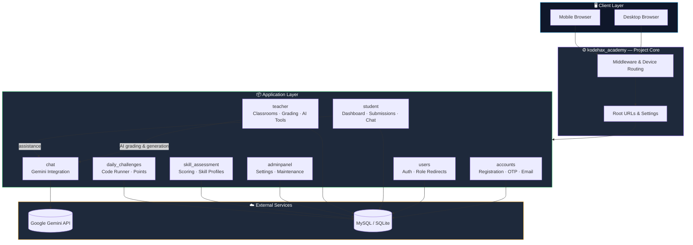

<div align="center">


<br/>

[](https://www.djangoproject.com/)
[](https://www.python.org/)
[](https://tailwindcss.com/)
[](https://www.mysql.com/)
[](https://ai.google.dev/)

[](https://github.com/DhruvarajK/kodehax_academy/stargazers)
[](https://github.com/DhruvarajK/kodehax_academy/network/members)
[](https://github.com/DhruvarajK/kodehax_academy/issues)
[](#-license)

<br/>

<a href="#-overview">Overview</a> •
<a href="#-core-features">Features</a> •
<a href="#-architecture">Architecture</a> •
<a href="#-tech-stack">Tech Stack</a> •
<a href="#-getting-started">Getting Started</a> •
<a href="#-roadmap">Roadmap</a>

</div>

<br/>

---

## 📖 Overview

**Kodehax Academy** is a multi-role Learning Management System focused on practical, technical education. It fuses classroom workflows with AI-assisted teaching tools, granular skill tracking, daily coding practice, and device-aware rendering — all inside a single, cohesive Django monolith.

The project is organized as a set of purpose-built apps: authentication, classroom operations, performance management, skill assessment, daily challenges, chat, and admin tooling — each with a clear boundary of responsibility.

<div align="center">
<table>
<tr>
<td align="center" width="20%">🎓<br/><b>Multi-Role</b><br/><sub>Student · Teacher · Admin</sub></td>
<td align="center" width="20%">🤖<br/><b>AI-Assisted</b><br/><sub>Gemini-powered tooling</sub></td>
<td align="center" width="20%">📊<br/><b>Skill Engine</b><br/><sub>Weighted assessment scoring</sub></td>
<td align="center" width="20%">🧩<br/><b>Daily Challenges</b><br/><sub>Sandboxed code execution</sub></td>
<td align="center" width="20%">📱<br/><b>Device-Aware</b><br/><sub>Mobile-first rendering</sub></td>
</tr>
</table>
</div>

---

## 🧭 What This Project Does

| Area | Highlights |
| :-- | :-- |
| 🎓 **Student experience** | Registration, login, dashboard, profile, assignments, quiz attempts, coding submissions, skill assessment, daily challenge workspace, chat |
| 🧑‍🏫 **Teacher workspace** | Classroom creation, assignment authoring, quiz generation, code/file grading, AI support tools, performance views, student progress tracking |
| 🛠️ **Admin controls** | Platform settings, maintenance mode, analytics-style dashboards, student and teacher management |
| 🧠 **Assessment engine** | Self-assessment, MCQs, coding exercises, weighted scoring, skill-level classification, weak-topic tracking |
| 🔥 **Daily practice** | Personalized daily coding challenges, hints, point deductions, execution sandboxing, leaderboard-oriented point tracking |
| 📱 **Device support** | Mobile template routing for selected views and role-aware UI rendering |

---

## ✨ Core Features

<details open>
<summary><b>1️⃣ Role-Based Learning Platform</b></summary>
<br/>

- Separate flows for students, teachers, and administrators
- Role-aware authentication and redirect handling
- Dedicated dashboards and templates for each product area
</details>

<details>
<summary><b>2️⃣ AI-Assisted Teaching Tools</b></summary>
<br/>

- Teacher-side quiz generation from natural language topics
- AI-generated lecture notes
- AI-assisted coding assignment generation
- AI-assisted grading for file and code submissions
</details>

<details>
<summary><b>3️⃣ Skill Assessment System</b></summary>
<br/>

- Multi-step student assessment flow
- Default MCQ and coding problem seeding
- Weighted scoring across self-assessment, MCQs, and coding tasks
- Skill level classification from beginner to expert
- Strong-topic and weak-topic summaries
</details>

<details>
<summary><b>4️⃣ Daily Coding Challenges</b></summary>
<br/>

- Daily challenge generation based on student skill state
- Difficulty tiers and progressive level unlocking
- Secure Python execution with restricted imports and blocked calls
- Attempt limits, penalties, hint purchases, and points tracking
- Automatic student skill refresh based on challenge performance
</details>

<details>
<summary><b>5️⃣ Classroom and Performance Management</b></summary>
<br/>

- Create classes and manage enrollments
- Create file, code, and quiz assignments
- Auto-grade quizzes
- Manual and AI-supported evaluation flows
- Student performance records and classroom analytics views
</details>

<details>
<summary><b>6️⃣ Responsive, Device-Aware Rendering</b></summary>
<br/>

- Mobile template mapping for key pages
- Dedicated mobile landing and student flows
- Shared backend rendering with device-based template selection
- Tailwind-backed frontend styling
</details>

---

## 🏗️ Architecture



<details>
<summary>📂 <b>Expand full directory structure</b></summary>

```text
kodehax/
├── kodehax_academy/        # project settings, middleware, mobile rendering, root urls
├── accounts/                # account flows, OTP/email-related templates and services
├── users/                   # custom user model, auth redirects, shared entry views
├── student/                 # student dashboards, submissions, chat memory, APIs
├── teacher/                 # classroom, assignments, grading, AI tools, performance
├── adminpanel/               # platform management, maintenance mode, admin dashboards
├── skill_assessment/         # assessment content, scoring, skill profile logic
├── daily_challenges/         # challenge generation, code runner, points, sessions
├── chat/                     # Gemini client integration and chat views
├── templates/                # desktop, mobile, shared, role-specific templates
├── static/                   # Tailwind source, compiled CSS, images
├── media/                    # uploaded files and generated user content
└── manage.py                 # Django entry point
```

</details>

### 🧩 Main Apps

| App | Responsibility |
| :-- | :-- |
| `accounts` | Registration, password reset, verification templates, account services |
| `users` | Custom user model, home page, login/logout, role redirects |
| `student` | Student dashboard, assignment submissions, profile, chat, APIs |
| `teacher` | Classroom workflows, assignments, grading, performance, AI authoring tools |
| `adminpanel` | Admin dashboard, site settings, maintenance mode, user management |
| `skill_assessment` | Assessment questions, coding problems, scoring, skill profiles |
| `daily_challenges` | Daily challenge generation, sandboxed execution, points, sessions |
| `chat` | Gemini client integration and chat endpoints |

---

## 🛠️ Tech Stack

<div align="center">

| Layer | Tools |
| :-- | :-- |
| **Backend** |   |
| **Database** |   PostgreSQL-ready via `dj-database-url` |
| **Frontend** | Django Templates ·  · PostCSS · Autoprefixer |
| **AI Integration** |  via `google-genai` |
| **Static Serving** | WhiteNoise |
| **Media & Storage** | Cloudinary · Django Storages |
| **Deployment** |   |

</div>

---

## 🚀 Getting Started

### Prerequisites


<details open>
<summary><b>Step 1 — Clone the repository</b></summary>

```bash
git clone https://github.com/DhruvarajK/kodehax_academy.git
cd kodehax_academy
```
</details>

<details open>
<summary><b>Step 2 — Create and activate a virtual environment</b></summary>

```bash
python -m venv venv
```

**Windows**
```bash
venv\Scripts\activate
```

**macOS / Linux**
```bash
source venv/bin/activate
```
</details>

<details open>
<summary><b>Step 3 — Install Python dependencies</b></summary>

```bash
pip install -r requirements.txt
```
</details>

<details open>
<summary><b>Step 4 — Install frontend dependencies</b></summary>

```bash
npm install
```
</details>

<details open>
<summary><b>Step 5 — Configure environment variables</b></summary>

Create a `.env` file in the project root using `.env.example` as the starting point.

```env
DEBUG=True
PRODUCTION=False
SECRET_KEY=replace-me
ALLOWED_HOSTS=127.0.0.1,localhost
GEMINI_API_KEY=replace-me
EMAIL_HOST=smtp.gmail.com
EMAIL_PORT=587
EMAIL_HOST_USER=
EMAIL_HOST_PASSWORD=
EMAIL_USE_TLS=True
DAILY_CHALLENGE_TIMEZONE=Asia/Kolkata
DAILY_CHALLENGE_PUBLISH_HOUR=10
DB_URL=
```
</details>

<details>
<summary><b>Step 6 — Configure the database</b></summary>

By default, the settings file expects MySQL in development:

```text
ENGINE: django.db.backends.mysql
NAME:   kodehax_academy
USER:   root
HOST:   localhost
PORT:   3306
```

> 💡 Prefer a lightweight local setup? The project also ships `kodehax_academy.test_settings`, which switches to SQLite.
</details>

<details>
<summary><b>Step 7 — Run migrations</b></summary>

```bash
python manage.py migrate
```
</details>

<details>
<summary><b>Step 8 — Create a superuser</b></summary>

```bash
python manage.py createsuperuser
```
</details>

<details>
<summary><b>Step 9 — Build frontend assets</b></summary>

```bash
npm run tailwind:build
```

For active development:

```bash
npm run tailwind:watch
```
</details>

<details>
<summary><b>Step 10 — Start the server</b></summary>

```bash
python manage.py runserver
```

Then open **http://127.0.0.1:8000/** 🎉
</details>

---

## 🧰 Useful Commands

<table>
<tr><th>Purpose</th><th>Command</th></tr>
<tr><td>Run with SQLite test settings</td><td><code>python manage.py runserver --settings=kodehax_academy.test_settings</code></td></tr>
<tr><td>Build Tailwind CSS</td><td><code>npm run tailwind:build</code></td></tr>
<tr><td>Watch Tailwind CSS</td><td><code>npm run tailwind:watch</code></td></tr>
<tr><td>Inspect quizzes</td><td><code>python manage.py inspect_quizzes --limit 2</code></td></tr>
<tr><td>Export quiz answers</td><td><code>python manage.py export_recent_quiz_answers --limit 10 --output ans_debug.txt</code></td></tr>
<tr><td>Regrade a quiz</td><td><code>python manage.py regrade_quiz 5 Mubashir114</code></td></tr>
</table>

---

## ⚙️ Environment Notes

> [!NOTE]
> - `GEMINI_API_KEY` enables AI-backed quiz generation, notes generation, coding assignment generation, and grading flows.
> - `DAILY_CHALLENGE_TIMEZONE` and `DAILY_CHALLENGE_PUBLISH_HOUR` control when daily challenges become active.
> - Email settings fall back to the console backend when SMTP credentials are not configured.
> - `PRODUCTION=True` activates database parsing through `DB_URL`.

---

## 🔍 Notable Implementation Details

### 🧠 Skill Assessment
- Seeds default assessment questions and coding problems
- Scores self-assessment, MCQs, and coding separately
- Produces a combined final skill score
- Stores weak topics and strong topics for future challenge generation

### 🔥 Daily Challenges
- Generates question sets from skill level and weak-topic context
- Executes student code in a restricted runner
- Tracks runtime, compilation, timeout, failed tests, penalties, and points
- Refreshes challenge-set summaries and student points automatically

### 🤖 Teacher AI Tooling
- Builds quizzes from topic prompts
- Produces classroom notes
- Creates coding assignments in a structured format
- Grades code and uploaded files with AI-backed feedback

### 📱 Mobile Rendering
- Uses `render_for_device(...)` to map selected desktop templates to mobile-specific templates
- Keeps the backend flow unified while allowing dedicated mobile UX where needed

---

## 📌 Current Repository Notes

> [!IMPORTANT]
> - The project contains both desktop and mobile templates under `templates/`
> - Root-level compatibility scripts are still present, but utility work has been moved into Django management commands
> - The current default local database configuration is MySQL, so `mysqlclient` must be installed for the default settings to boot cleanly

---

## 🗺️ Roadmap

- [ ] Add automated test coverage for core student and teacher workflows
- [ ] Move sensitive development defaults fully into environment variables
- [ ] Add richer dashboard analytics and reporting
- [ ] Expand mobile-specific coverage for more classroom screens
- [ ] Add CI for migrations, linting, and template build validation

---

## 📄 License

This repository does not currently declare a license. Add one before public distribution if you plan to open-source the project.

<br/>

<div align="center">


<sub>Built with ❤️ using Django, Tailwind CSS, and Gemini AI</sub>

</div>
